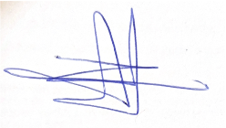
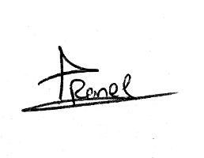
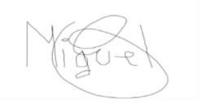

# Song-hub

**Grupo:** 1
**Curso escolar:** 2024/2025  
**Asignatura:** Evolución y Gestión de la Configuración
**Profesor:** David Romero Organvídez

**Repositorio:** https://github.com/Song-hub-egc/song-hub.git 

---

## Miembros del grupo (orden alfabético por apellido)

- del Castillo Piñero, Daniel  
- Gómez Vela, Miguel Ángel *(Coordinador)*  
- Manzanos Anento, Diego  
- Pérez Gaspar, Pablo  
- Petre, Rares Nicolae  
- Villalba Fernández, Jesús  

---

## Resumen total de reuniones

- **Total de reuniones (TR):** 1  
- **Total de reuniones presenciales (TRP):** 0  
- **Total de reuniones virtuales (TRV):** 1 
- **Total de tiempo empleado en reuniones presenciales (TTRP):** 0h  
- **Total de tiempo empleado en reuniones virtuales (TTRV):** 0h  

---

## Actas de acuerdos

### ACTA 2024-01 — Acta fundacional  
**Fecha:** 12/10/2025  
**Asistentes:** Todos los miembros del equipo  

#### Acuerdos tomados

**Acuerdo 2024-01-01:** Se establecen las siguientes reglas básicas de trabajo:  
- Asistencia y participación obligatoria a las reuniones, avisando con antelación en caso de ausencia.  
- Comunicación interna mediante *Discord* y *WhatsApp*, con respuesta esperada en menos de 24 horas.  
- Reparto equitativo de tareas según habilidades y disponibilidad.  
- Las decisiones se tomarán por consenso, y en caso de empate, el coordinador decidirá.

**Acuerdo 2024-01-02:** Se define el procedimiento de gestión de conflictos:  
- Si hay falta de participación por más de dos semanas, se notificará al miembro y se informará al coordinador.  
- Las diferencias de opinión se resolverán por votación si no hay consenso.  
- El coordinador fomentará la cooperación ante diferencias de nivel o motivación.

**Acuerdo 2024-01-03:** Se establecen sanciones internas progresivas:  
1. Aviso formal en reunión.  
2. Notificación al coordinador.  
3. Intervención del coordinador y posible baja del equipo.  
En casos graves se podrá acudir directamente al coordinador.

**Acuerdo 2024-01-04:** El acta fundacional podrá modificarse solo por consenso unánime y deberá firmarse por todos los miembros tras cualquier cambio.

**Acuerdo 2024-01-05:** Todos los miembros firman el compromiso de cumplir las normas y mantener un ambiente de respeto y responsabilidad.

---

## Firmas de los integrantes

| Integrante | Firma |
|-------------|--------|
| Jesús Villalba Fernández |  |
| Rares Nicolae Petre |  |
| Daniel del Castillo Piñero |  |
| Pablo Pérez Gaspar |  |
| Diego Manzanos Anento |  |
| Miguel Ángel Gómez Vela *(Coordinador)* |  |

---

**Documento basado en:** ACTA FUNDACIONAL DEL EQUIPO (12/10/2025)  
