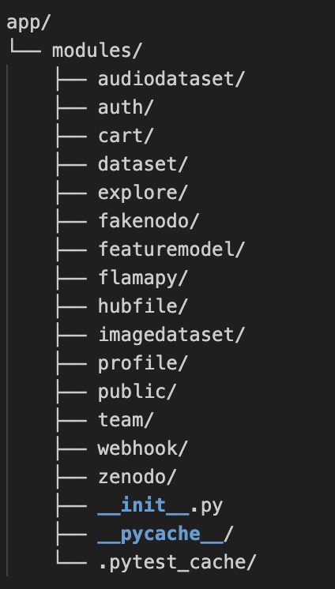

# Documento del Proyecto

**Proyecto:** SongHub  
**Curso:** 2025/2026  
**Equipo:** Grupo 1

**Miembros:** 
- del Castillo Piñero, Daniel  
- Gómez Vela, Miguel Ángel 
- Manzanos Anento, Diego  
- Pérez Gaspar, Pablo  
- Petre, Rares Nicolae  
- Villalba Fernández, Jesús
  
**Repositorio:** https://github.com/Song-hub-egc/song-hub.git

**Última edición:** 15/12/2025

## Indicadores del proyecto
Enlaces de evidencias:
- Tablero de issues: https://github.com/orgs/Song-hub-egc/projects/3 
- Contributors (gráfica de commits y líneas por persona): https://github.com/Song-hub-egc/song-hub/graphs/contributors 
                    

| Miembro               | Horas | Commits | LoC | Test | Issues | Work Item principal       | Dificultad |
|-----------------------|------:|--------:|----:|-----:|-------:|---------------------------|-----------:|
| del Castillo Piñero, Daniel     |  50   |   20   | 2363  |  10  |  5    | Download own dataset(carrito)        | M     |
| Gómez Vela, Miguel Ángel     |  50   |   12    | 794  |  22  |  4    | Download counter         | L      |
| Manzanos Anento, Diego     |  50   |   11    | 2391  |  23  |  2    | Session management         | H      |
| Pérez Gaspar, Pablo      |  50   |   26    | 3058  |  19  |  1    | Autenticación(2FA) (H), newDataset (M)         | H,M    |
| Petre, Rares Nicolae    |  50   |   28    | 1560  |  15  |  2    | Comments on datasets         | L      |
| Villalba Fernández, Jesús     |  72   |   55    | 4510  |  18  |  20    | Trenging datasets (M), fakenodo (L), newDataset (M). A parte de eso: prehooks, workflows, documentación        | 2M,L |
| **TOTAL**             | 322   |  152    | 14676 | 107  | 34    | Resumen WI                | H(2)/M(4)/L(3) |

- **Horas:** esfuerzo estimado/registrado por persona. 
- **Commits:** realizados por el equipo durante el proyecto.  
- **LoC:** líneas netas aportadas por el equipo (sin terceros).  
- **Test:** pruebas nuevas añadidas.  
- **Issues:** issues gestionadas por el equipo.  
- **Work Item:** responsabilidad principal de cada miembro.  
- **Dificultad:** alta/media/baja; en totales indicar cuántas de cada tipo.

## Integración con otros equipos

No ha habido integración con otros equipos externos al grupo; todo el trabajo se ejecutó de forma autónoma dentro de la célula Song-Hub.

## Resumen ejecutivo 

El proyecto Song-Hub surge como una evolución completa del sistema UVLHUB, originalmente diseñado como un repositorio de feature models. A lo largo del trabajo, lo hemos transformado en una plataforma web especializada en datasets musicales, centrada en mejorar la seguridad, la experiencia de usuario y la eficiencia técnica. El objetivo fue pasar de una aplicación académica y genérica a una herramienta moderna, práctica y enfocada en la comunidad musical y de investigación.

Desde el principio, el enfoque fue doble: mejorar la funcionalidad para los usuarios y profesionalizar el entorno técnico del proyecto. Para conseguirlo, se rediseñó por completo la arquitectura, se implementaron nuevas funciones, se mejoraron los procesos de desarrollo y se automatizaron las tareas de despliegue y pruebas.

### Alcance y objetivos

El sistema se construyó sobre Flask (Python 3.12) con MariaDB como base de datos principal. Todo el código se reestructuró en módulos independientes dentro de app/modules, de forma que cada componente (auth, dataset, cart, comments, etc.) se pueda mantener y extender sin afectar al resto.
Esta modularidad permitió que cada miembro del grupo trabajara en áreas distintas sin solaparse y facilitó la integración de nuevas funciones.

Además, se dockerizó la aplicación para simplificar el despliegue: cualquier persona puede ejecutar Song-Hub con un solo comando sin tener que instalar dependencias manualmente. Esto se complementa con scripts automáticos que crean la base de datos, aplican migraciones y cargan datos de ejemplo, agilizando la preparación del entorno de desarrollo.

### Principales mejoras funcionales

Las funcionalidades añadidas y rediseñadas fueron clave para transformar UVLHUB en un sistema mucho más útil y dinámico:

- Autenticación en dos factores (2FA): Ahora el usuario puede habilitar un segundo paso de verificación mediante un código QR. Aumenta notablemente la seguridad al requerir una clave temporal además de la contraseña.

- Carrito de descargas: Permite seleccionar varios datasets, añadirlos a un carrito y descargarlos todos de una sola vez. Es una de las mejoras más notables en comodidad y eficiencia.

- Datasets de moda (Trending): La página principal muestra los datasets más vistos y descargados, gracias a un sistema de métricas que registra la actividad de los usuarios.

- Comentarios en datasets: Cada dataset permite abrir hilos de conversación, fomentando la interacción entre usuarios y creando un espacio de colaboración dentro de la propia plataforma.

- Sesiones activas: Los usuarios pueden ver qué sesiones tienen abiertas y cerrarlas desde su perfil, reforzando la seguridad y el control de su cuenta.

- Nuevos tipos de dataset: Además de los UVL, el sistema ahora admite datasets de imágenes y de audio, con la posibilidad de reproducir los audios desde la propia interfaz.

- Fakenodo y DOIs simulados:Se desarrolló un módulo que emula el comportamiento de Zenodo, generando identificadores DOI y gestionando webhooks sin depender de servicios externos.

Estas funcionalidades, junto con los contadores de descargas y las estadísticas, convierten Song-Hub en un sistema más atractivo, participativo y transparente.

### Metodología 

Desde el punto de vista técnico, el sistema se apoya en Flask (Python 3.12), con MariaDB como base de datos y SQLAlchemy + Alembic para la parte de ORM y migraciones. El backend se organiza en módulos dentro de app/modules, de forma que lógica, modelos y rutas de cada área quedan agrupados y aislados.

Para facilitar el trabajo en equipo y evitar problemas de “en mi máquina funciona”, se ha dockerizado el proyecto. Mediante Docker y docker-compose se pueden levantar los servicios principales (backend, base de datos, etc.) con un solo comando. Además, se han creado scripts que automatizan la recreación de la base de datos, la aplicación de migraciones y el seed de datos de prueba, simplificando enormemente la puesta en marcha del entorno.

En cuanto al ciclo de desarrollo, se ha utilizado GitHub como repositorio central con un flujo de ramas tipo EGC-flow, donde la rama trunk concentra el desarrollo diario y main se reserva para versiones estables. Sobre este modelo se han montado workflows de GitHub Actions que:

- ejecutan tests con pytest y los comandos de rosemary,
- pasan linters (black, isort, flake8),
- analizan la calidad del código con herramientas externas,
- automatizan el despliegue en Render y la publicación de imágenes en Docker Hub.

También se han integrado herramientas de testing como Selenium (para pruebas de interfaz) y Locust (para pruebas de carga), que se ejecutan en momentos concretos para validar tanto el comportamiento funcional como el rendimiento bajo carga.

### Organización del equipo y gestión 

El trabajo se organizó íntegramente desde el tablero de GitHub Projects, donde cada issue representaba una tarea concreta (feature, fix o mejora).
Cada miembro del grupo asumió responsabilidades distintas: desarrollo de módulos, documentación, configuración de pipelines o testing.
Este enfoque permitió trabajar en paralelo y mantener un control claro del progreso y de las revisiones.

El equipo no dependió de otros grupos externos, por lo que todo el trabajo, desde la planificación hasta el despliegue final se hizo de forma autónoma, garantizando una comprensión total del sistema y de su evolución.

## Descripción del sistema

Song-Hub es una plataforma web centrada en la gestión y descarga de datasets relacionados con la música.
Parte del sistema original UVLHUB, pero lo hemos transformado completamente para que funcione como un repositorio más especializado y moderno.
La idea principal fue pasar de un sistema genérico de feature models a una plataforma que permita subir, visualizar y compartir datasets musicales, con nuevas funcionalidades que mejoran la seguridad, la interacción entre usuarios y la experiencia de uso.

La app está montada sobre una arquitectura modular en Flask, conectada con una base de datos MariaDB, y organizada para que cada módulo (auth, datasets, etc.) sea independiente del resto.
Además, todo el entorno se puede desplegar con Docker, así que cualquiera puede levantar el proyecto sin tener que configurar nada a mano.

### Arquitectura general

Song-Hub sigue el esquema clásico de arquitectura cliente-servidor en tres capas, pero lo mantenemos bastante limpio:

1.	Capa de presentación (Frontend)

Se basa en plantillas Jinja2 combinadas con HTML, CSS y algo de Bootstrap.
Aquí está la parte visual: formularios, vistas de datasets, perfil, carrito, etc.

2.	Capa de lógica de negocio (Backend)

Es el núcleo del sistema, desarrollado en Flask (Python 3.12).
Se encarga de todo lo importante: autenticación, gestión de usuarios, subida de datasets, comentarios, estadísticas y descargas.
Cada módulo está separado dentro de /app/modules para que sea fácil mantener y añadir nuevas funciones sin romper nada.

3.	Capa de persistencia (Base de datos)

Usamos MariaDB 12.0.2 junto con SQLAlchemy y Alembic para las migraciones.
Ahí se guarda todo: usuarios, datasets, descargas, comentarios y sesiones activas.

### Componentes del sistema 

El backend se divide en módulos aislados dentro de app/modules/, cada uno con sus modelos, servicios, ....

#### Autenticación – app/modules/auth/
Gestiona registro, login y recuperación de cuentas. Implementa el doble factor de autenticación (2FA) enviando códigos temporales por correo y registra las sesiones activas (user_sessions). Incluye vistas para revocar sesiones y reforzar la seguridad.

#### Datasets – app/modules/dataset/
Es el núcleo del proyecto. Implementa la arquitectura BaseDataset + subtipos para admitir UVL, datasets musicales y futuros dominios. Permite crear/editar/versionar, previsualizar audios/imágenes, descargar archivos y consumir los DOIs generados tras la integración con Zenodo/Fakenodo. También contiene los tests.

#### Carrito – app/modules/cart/
Expone endpoints para añadir/quitar datasets del carrito y generar descargas masivas en ZIP. Se apoya en la sesión del usuario y en servicios que actualizan los contadores cuando se materializa la descarga.

#### Comentarios – app/modules/comments/
Proporciona el CRUD de comentarios por dataset, con permisos (solo autor o admins pueden editar/borrar), paginación y controles de spam. Se integra directamente en la ficha del dataset.

#### Sesiones activas – app/modules/auth/sessions
Submódulo dentro de auth que persiste sesiones, registra dispositivo/ip y ofrece endpoints para listarlas y revocarlas desde el perfil.

#### Integraciones externas – app/modules/webhook/ + fakenodo/
webhook recibe notificación de Zenodo/Fakenodo, valida firmas (WEBHOOK_SHARED_SECRET) y actualiza estados de publicación. El microservicio fakenodo/ simula la API de Zenodo para generar DOIs de prueba y enviar webhooks durante el desarrollo.

### Estructura interna del proyecto

A nivel de backend, el código de Song-Hub se organiza principalmente dentro de la carpeta app/, y dentro de ella el corazón funcional está en app/modules, donde cada módulo representa una parte concreta del sistema.

La estructura simplificada de app/modules es la siguiente:

Los directorios __pycache__ y .pytest_cache son generados automáticamente por Python y pytest, así que no forman parte de la lógica del sistema como tal.
Los módulos funcionales principales son:
- auth/: toda la parte de autenticación y gestión de usuarios, incluyendo login, registro y el sistema de doble factor (2FA).
- public/: vistas públicas de la aplicación (portada, landing, listado general, etc.), incluyendo la sección donde se muestran los datasets más populares o en tendencia.
- profile/: gestión del perfil de usuario, edición de datos personales y visualización de sesiones activas.
- dataset/: lógica principal para la creación, edición, visualización y descarga de datasets genéricos.
- audiodataset/: funcionalidades específicas para datasets de audio (subida de canciones, botón de preview, etc.).
- imagedataset/: funcionalidades específicas para datasets de imágenes.
- cart/: implementación del carrito de descargas, donde el usuario puede acumular varios datasets y descargarlos juntos.
- explore/: búsquedas, filtrado y exploración de datasets según tipo, popularidad, etiquetas, etc.
- fakenodo/ y zenodo/: módulos que simulan la integración con Zenodo; se encargan de generar y gestionar los DOIs que se asignan a los datasets nuevos.
- featuremodel/ y flamapy/: heredados del sistema original UVLHUB, relacionados con la parte de feature models y la integración con Flamapy. Algunos de estos componentes se mantienen por compatibilidad y como soporte a funcionalidades previas.
- hubfile/: gestión de archivos asociados al hub (subida, almacenamiento y descarga de ficheros relacionados).
- team/: vistas relacionadas con la información del equipo (páginas estáticas tipo “sobre el proyecto / sobre el equipo”).
- webhook/: lógica de integración con servicios externos mediante webhooks (por ejemplo, notificaciones o sincronización con otros sistemas).

En la mayoría de estos módulos se sigue una estructura parecida:
suele haber ficheros como routes.py (rutas y controladores Flask), models.py (modelos de base de datos), services.py o similares para la lógica de negocio y, cuando aplica, una carpeta tests/ con las pruebas asociadas a ese módulo.

Esta organización por módulos permite que cada parte del sistema esté relativamente aislada: se puede modificar, extender o depurar un área concreta (por ejemplo, audiodataset o cart) sin tener que tocar el resto del código, lo que facilita bastante el mantenimiento y la incorporación de nuevas funcionalidades en el futuro.

### Cambios que se han desarrollado para el proyecto

Los cambios que se han llevado a cabo en el proyecto son los siguientes:

1. Autenticación (2FA): Se ha añadido más seguridad a la aplicación y ahora cuanto te registras puedes solicitar mediante un código qr que además de ingresas tu contraseña para entrar tienes que meter un código.
2. Carrito de descargas: Se ha añadido la opción de subir al carrito todos los datasets que quieras y una vez en el carrito puedes descargar todos o uno en particular.
3. Datasets de moda (Trending Datasets): Al principio de la página principal se ve un ranking de los datasets más descargados y vistos.
4. Comentarios: Se ha añadido la opción de comentar los datasets y poder mantener una conversación.
5. Sesiones activas: Hay ahora la posibilidad de ver un perfil que sesiones tiene activas.
6. Contador de descargas: Existe un contador para enumerar las descargas que ha tenido un dataset en particular.
7. Fakenodo: Se ha simulado el Zenodo y ahora cuando se crea un dataset se crea con un DOI aleatorio.
8. Newdataset: Existe la posibilidad de subir distintos tipos de dataset (uvl, imágenes o audios) y cuando se suben audios se puede escuchar ese audio mediante el botón de preview. Dentro del dataset se pueden descargar y subir al carrito. Se han puesto ejemplos de datasets de canciones ya que está relacionado con song-hub.

## Visión global del proceso de desarrollo

### Entorno de desarrollo

El entorno de desarrollo de Song-Hub se diseñó para ser homogéneo, reproducible y fácilmente automatizable. Desde el inicio del proyecto, establecimos como premisa trabajar con con buena documentación, de modo que cualquier miembro del equipo pudiera incorporarse sin complicaciones y cualquier docente o evaluador pudiera reconstruir el entorno y probarlo sin dificultad.

El IDE que usamos principalmente en Song-Hub fue Visual Studio Code, que configuramos con todo lo necesario para tener una experiencia de desarrollo cómoda y uniforme entre todos.

Los linters (black, isort y flake8) estaban integrados directamente en VS Code y se ejecutaban automáticamente al guardar los archivos, así que el código siempre quedaba limpio sin tener que hacerlo a mano.
Además, aprovechábamos la integración con Git y GitHub para gestionar las ramas directamente desde el editor, lo que nos ahorraba tiempo.

#### Sistema operativo

La mitad del equipo (3 compañeros) trabajaron en Ubuntu Linux 22.04 LTS, mientras que los otros 3 miembros utilizaron macOS.
Los ajustes más relevantes se centraron en scripts para que funcionara el docker, ya que los compañeros de macOS tenían problemas para arrancarlo.

#### Lenguajes y dependencias

El proyecto Song-Hub está desarrollado principalmente en Python 3.12, que usamos para prácticamente todo: el backend en Flask, los servicios de negocio (autenticación, datasets, featuremodels, webhooks), los scripts de migración y las herramientas internas del proyecto, como rosemary, los seeders o los scripts de despliegue.
La base de datos está montada sobre MariaDB.

Entre las librerías más importantes están:
- pytest y rosemary, para los tests unitarios e integrados.
- black, isort, flake8 y autoflake, para mantener el código limpio y con estilo uniforme.
- El CLI interno rosemary, que usamos a diario para ejecutar linters, correr tests, hacer seeders, limpiar logs o automatizar despliegues.

También usamos Node.js 20 para tareas puntuales, como recompilar los assets estáticos, ejecutar Selenium dentro de los contenedores o preparar el build del frontend en entornos de staging.
Aun así, todo el corazón lógico del sistema y los pipelines de CI/CD se mantienen íntegramente en Python, lo que hace que el proyecto sea más sencillo de mantener y que cualquier miembro del equipo pueda ponerse al día sin problema.

#### CI/CD y versiones

El proyecto utilizó Git como sistema de control de versiones, con GitHub como repositorio remoto.
Adoptamos un flujo EGC-FLOW:
- trunk → rama principal de desarrollo diario
- main → versiones estables

Las ramas se crean desde trunk y se nombraron de la siguiente manera:
- feature/<nombre> → nuevas funcionalidades
- fix/<nombre> → corrección de errores

La integración continua (CI/CD) se gestionó con GitHub Actions, incluyendo distintos workflows:
- CI_pytest: ejecuta los tests de pytest sobre contenedores con PostgreSQL/MariaDB
- CI_lint: aplica black, isort y flake8
- CI_commits: valida el formato Conventional Commits
- CI_sonarqube, CI_codacy: analizan la calidad del código
- CD_dockerhub, CD_render: publican imágenes en Docker Hub y despliegan automáticamente en Render

Además, se configuraron hooks locales en .git/hooks (en el proyecto está en la carpeta /githooks)para que todo tuviera el estilo del lint antes de permitir commits y que se validara que el formato del commit era Conventional Commits.

#### Pruebas 

- rosemary test → comando para correr los tests unitarios
- rosemary coverage → comando para medir la cobertura
- pytest -v → comando para probar los tests de interfaz (Selenium)
- locust -f app/modules/dataset/tests/locustfile.py → comando para las pruebas de carga (locust)

Los workflows de GitHub Actions se ejecutan en cada rama al subir cambios, mientras que las pruebas unitarias, de interfaz y de carga se llevan a cabo manualmente.

#### Instalación y ejecución del sistema

1. Clonar el repositorio

   git clone https://github.com/Song-hub-egc/song-hub.git
   cd song-hub

2. Crear el entorno virtual

   python3.12 -m venv venv
   source venv/bin/activate
   pip install --upgrade pip
   pip install -r requirements.txt
   pip install -e .

3. Configurar la base de datos de MariaDB

   Todos estos pasos lo hace automáticamente si llamas al script siguiente:

   sudo ./scriptbasededatos.sh

   sudo mysql -u root -p
   CREATE DATABASE uvlhubdb;
   CREATE DATABASE uvlhubdb_test;
   CREATE USER 'uvlhubdb_user'@'localhost' IDENTIFIED BY 'uvlhubdb_password';
   GRANT ALL PRIVILEGES ON uvlhubdb.* TO 'uvlhubdb_user'@'localhost';
   GRANT ALL PRIVILEGES ON uvlhubdb_test.* TO 'uvlhubdb_user'@'localhost';
   FLUSH PRIVILEGES;
   EXIT;
   flask db upgrade
   rosemary db:seed

4. Correr la aplicación

   flask run --host=0.0.0.0 --reload --debug (puerto 5000)

### Ejercicio de propuesta de cambio

Se presentará el siguiente work item nuevo: poder ver los datasets subidos por un perfil, que ilustra todo el proceso de evolución y gestión de la configuración del proyecto de la siguiente manera.

#### 1 Creación de la tarea en el tablero
El primer paso consiste en crear la tarea en el tablero de issues del proyecto. Para ello, se crea una issue que describa de manera clara y concisa el objetivo del cambio: ya sea implementar una nueva funcionalidad, corregir un error existente o realizar una mejora en el sistema. Una vez generada, la tarea se ubica inicialmente en la columna TO DO y se aigna a un miembro del grupo, donde se encuentran todos los elementos pendientes de abordar. Esta fase permite que el equipo mantenga una visión global del trabajo por realizar y que las tareas queden correctamente priorizadas antes de comenzar su desarrollo.

#### 2 Creación de la rama correspondiente
Esta rama siempre debe originarse desde la rama trunk. El nombre de la rama dependerá del tipo de modificación que se vaya a realizar: “feature/nombre-de-la-tarea” para funcionalidades nuevas o ampliaciones, y “bugfix/descripción-del-cambio” para resolver errores. Para crear la rama se ejecutan los siguientes comandos: git checkout trunk y git checkout -b nombre-de-la-rama. Una vez creada la rama, se actualiza el tablero moviendo la issue al estado IN PROGRESS, indicando así al resto del equipo que se ha comenzado a trabajar en dicha tarea.

#### 3 Desarrollo de la tarea y subida inicial de cambios
Durante esta fase, es recomendable realizar commits atómicos y periódicos, especialmente si se desea compartir los avances con otros miembros del equipo. Para subir los cambios se ejecutan los comandos git add ., git commit -m "mensaje-del-commit" y git push. Es importante respetar el formato de Conventional Commits, lo cual facilita la comprensión del historial y permite automatizar procesos como el versionado semántico. El mensaje del commit deberá seguir la estructura “feat(scope): descripción del cambio” para nuevas funcionalidades o “fix(scope): descripción del cambio” para correcciones.

#### 4 Ejecución de pruebas
Una vez completada la implementación, se debe realizar un conjunto de pruebas que validen la calidad y el correcto funcionamiento de los cambios. Entre las pruebas contempladas se incluyen pruebas de interfaz utilizando Selenium, pruebas de carga con Locust y pruebas unitarias. Tras completar las pruebas, es necesario subir estos cambios a la rama siguiendo los comandos anteriores. Si el commit contiene únicamente pruebas, el prefijo adecuado será “test”, en caso contrario será el descrito en el paso anterior, manteniendo el estándar de Conventional Commits.

#### 5 Integración de cambios en la rama trunk
Cuando la tarea ha sido desarrollada y validada con las pruebas correspondientes, llega el momento de incorporar los cambios en la rama trunk del proyecto. El procedimiento consiste en ejecutar git checkout trunk, git merge nombre-de-la-rama y git push. Esto actualiza la rama trunk con el nuevo código. Luego, la tarea se mueve a la columna REVIEW del tablero, indicando que está lista para ser revisada por el equipo. Si los miembros consideran que los cambios son correctos, la tarea pasa a DONE. Si se requieren correcciones, se vuelve al paso 3 para aplicar los cambios necesarios, subirlos de nuevo y repetir el proceso de revisión.

#### 6 Integración en rama main
Por último, cuando el equipo de desarrollo considera oportuno generar una nueva release, se procede a integrar los cambios de la rama trunk en la rama main y a crear una nueva etiqueta de versión. Para ello, se ejecutan los siguientes comandos en este orden: git checkout main, git merge trunk, git push, git tag -a version, y finalmente git push origin version.

### Conclusiones y trabajo futuro

#### Conclusiones
Song-Hub ha pasado de ser una simple evolución de UVLHUB a convertirse en una plataforma especializada en datasets musicales, mucho más sólida, segura y atractiva para el usuario. El sistema ha sido completamente refactorizado, incorporando una arquitectura modular en Flask, autenticación en dos factores (2FA), un sistema de carrito de descargas, métricas de popularidad y un apartado de comentarios que fomenta la interacción entre usuarios.

A nivel técnico, la integración continua con GitHub Actions, el despliegue automatizado en Render, la dockerización y los scripts de automatización han elevado notablemente la calidad y la mantenibilidad del proyecto.
El uso de linters, pruebas automatizadas y flujos de trabajo controlados ha permitido mantener un código limpio, coherente y fácil de escalar, sentando una base sólida para futuras versiones.

En conjunto, Song-Hub se consolida como una aplicación moderna, bien estructurada y completamente funcional, preparada para seguir creciendo. El proyecto demuestra que con una buena organización, una metodología clara y una visión común, es posible transformar un sistema heredado en una plataforma profesional lista para su uso real y su evolución a largo plazo.

#### Trabajo futuro
El proyecto deja abiertas varias líneas de mejora que permitirán seguir ampliando sus capacidades y alcance:
- Internacionalización: incorporar soporte multilingüe para que Song-Hub pueda ser utilizado fuera del ámbito hispanohablante.
- Interacción social: añadir valoraciones o reacciones con emojis (“me gusta”, “favorito”, etc.) para hacer la plataforma más participativa.
- Notificaciones y suscripciones: implementar alertas internas o por correo para avisar de nuevas versiones, respuestas o actividad en datasets seguidos.
- Monitoreo y observabilidad: integrar métricas y sistemas de logs centralizados que permitan detectar incidencias y medir el rendimiento en tiempo real.
- Automatización de QA: ampliar las pruebas unitarias, de interfaz (Selenium) y de carga (Locust), aumentando la cobertura y asegurando una mayor estabilidad en los despliegues.

Estas mejoras futuras asegurarán que Song-Hub siga evolucionando como un proyecto vivo, orientado a la innovación y a la mejora continua tanto en su funcionalidad como en su experiencia de usuario.
